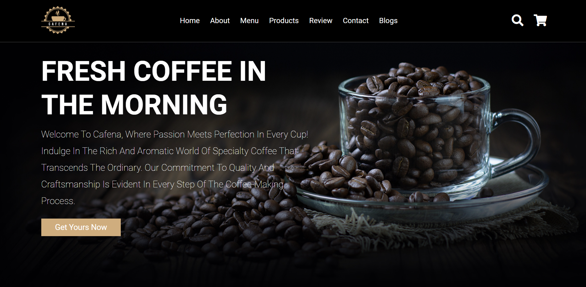

# Cafena - Your Ultimate Coffee Experience
<p align="center">
  
</p>

## Overview
Welcome to Cafena, where the aroma of freshly brewed coffee meets the elegance of web design. This website is a showcase of our commitment to delivering an exceptional coffee experience, coupled with the seamless integration of HTML, CSS, and JavaScript.

## Features
- **Interactive Design:** Engage with a visually appealing and user-friendly interface that enhances your journey through the world of coffee.
- **Menu Showcase:** Explore our curated coffee menu, beautifully presented with HTML and CSS to highlight the diverse offerings.
- **Dynamic Content:** Experience the dynamic elements powered by JavaScript, ensuring a responsive and interactive environment.

## Technologies Used
- **HTML:** The backbone of our website, providing structure and organization to the content.
- **CSS:** Styling magic that transforms the layout into an aesthetically pleasing and cohesive design.
- **JavaScript:** Bringing interactivity to life, making the user experience dynamic and engaging.

## Installation
To run Cafena locally, follow these steps:

1. Clone this repository:
   ```bash
   git clone https://github.com/AchrafMR/Coffe-Website.git
2. open file : index.html
## created by : acharfmechhour